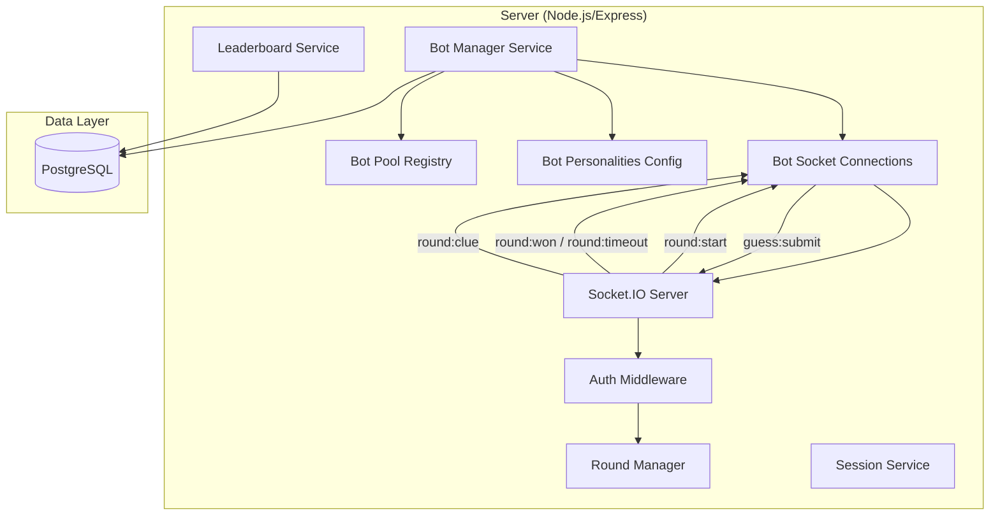
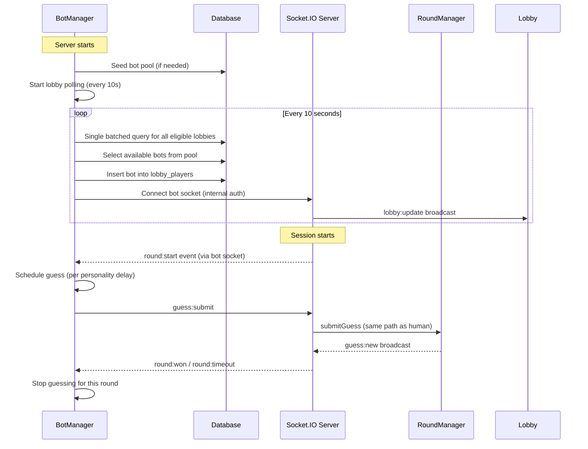
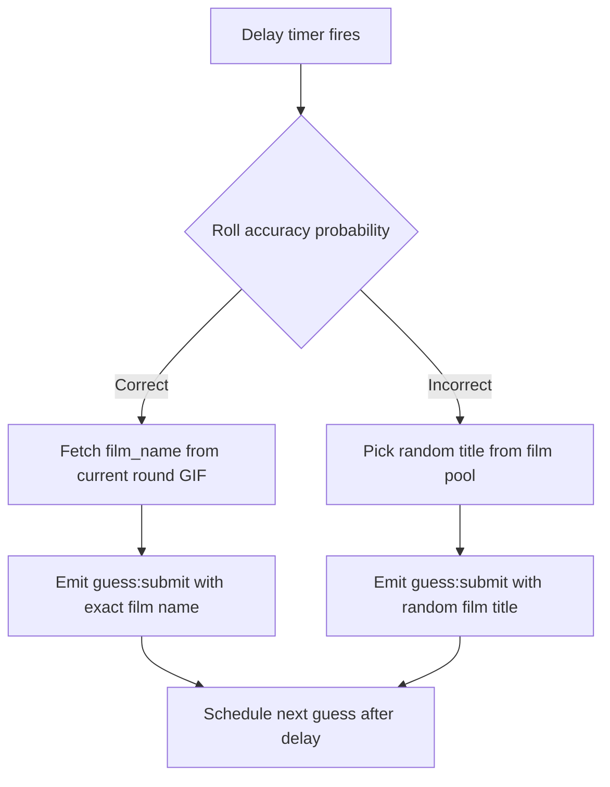
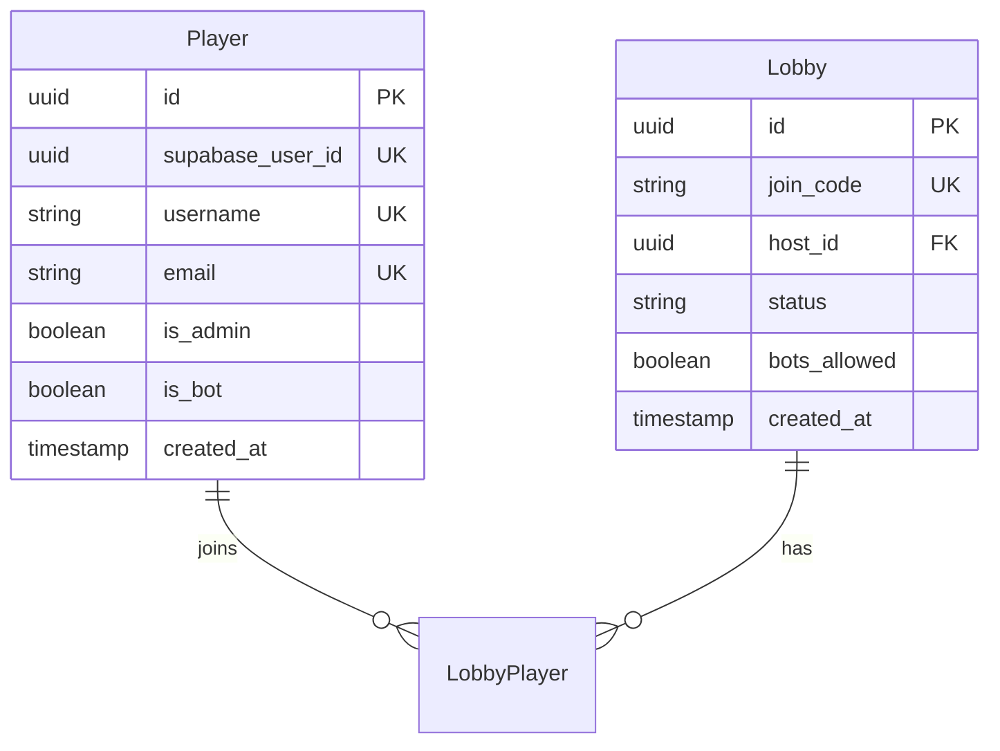

# Design Document: Always-On Bot Players

## Overview

Always-On Bot Players introduces a server-side BotManager service that automatically creates and coordinates automated players within the existing Guess the Gif game. Bots connect via internal Socket.IO connections (bypassing Supabase auth), join lobbies that opt in, and participate in rounds by submitting guesses with configurable skill tiers (Novice, Intermediate, Expert). The feature ensures games are always active, while keeping bot scores separate from the season leaderboard to preserve human competition.

### Scalability Target

The system is designed with an eye toward supporting 100 concurrent lobbies where ~60% are filled with bots. That translates to ~60 lobbies with 2 bots each = ~120 concurrent bot socket connections. This isn't an immediate MVP requirement, but it informs the architectural choices below (batched queries, lightweight in-process sockets, single-query polling).

### Key Design Decisions

- **Internal Socket.IO connections**: Bots connect to the same Socket.IO server instance in-process using `socket.io-client`. This avoids network hops and leverages the existing guess submission pipeline (rate limiting, mutex, broadcasting) without special-casing bot logic in the RoundManager.
- **Bot auth bypass in production**: The existing dev-only bypass pattern is adapted into a production-safe internal auth mechanism. Bots authenticate using a shared internal secret (`BOT_INTERNAL_SECRET` env var) rather than Supabase JWTs, keeping the auth middleware clean.
- **Personality-driven behavior**: Bot guessing behavior is fully configurable per personality tier. Delay ranges and accuracy probabilities are defined in a typed config object, making it easy to tune or add new tiers.
- **Polling-based lobby monitoring**: The BotManager polls for eligible lobbies on a fixed interval (every 10 seconds). Each poll cycle executes a single batched SQL query that returns all eligible lobbies at once — not one query per lobby. This is simpler and more resilient than event-driven approaches, and scales linearly regardless of lobby count.
- **Leaderboard exclusion via `is_bot` flag**: Rather than maintaining a separate scoring system, bots score normally through the existing flow, and leaderboard queries simply filter out `is_bot = true` players. This keeps the game logic uniform.
- **Bot pool seeding on startup**: The BotManager seeds the database with pre-registered bot player records on first run. Each bot has a persistent identity with a personality-based username.

## Architecture

The BotManager integrates as a new service module within the existing server process, sitting alongside the existing game engine components.



### Bot Lifecycle Flow



### Scalability Considerations

- **Lightweight socket connections**: Bot sockets are in-process (`socket.io-client` connecting to the same server). There's no outbound network, no TLS overhead, and no OS-level socket allocation — these are effectively just event emitter registrations in memory.
- **Batched polling queries**: At 120 bots, polling every 10s means 1 DB query per cycle (not per bot). The eligible-lobby query returns all qualifying lobbies in a single batched SQL query regardless of lobby count.
- **Negligible timer overhead**: Bot guess timers are just `setTimeout` calls — each one costs ~48 bytes of heap. Even at 120 bots with active timers, this is well under 10KB total.
- **Future horizontal scaling**: If scaling beyond a single process, the BotManager can be extracted to a separate worker process that connects to the Socket.IO server over a local network socket. This is a future consideration, not MVP scope.

## Components and Interfaces

### New Service: BotManager

#### Environment Variables

All bot system configuration is driven by environment variables with sensible defaults:

```
BOT_INTERNAL_SECRET=        # Required: shared secret for bot auth
BOT_ENABLED=true            # Enable/disable bot system entirely
BOT_POLL_INTERVAL_MS=10000  # How often to check for eligible lobbies
BOT_LOBBY_WAIT_THRESHOLD_MS=30000  # Time lobby waits before bots join
BOT_AUTO_START_THRESHOLD_MS=60000  # Time before auto-starting with bots
BOT_MAX_PER_LOBBY=2         # Max bots per lobby
BOT_POOL_SIZE=6             # Total bot player records to seed (min 2 per tier)
BOT_POOL_NOVICE=2           # Number of novice bots
BOT_POOL_INTERMEDIATE=2     # Number of intermediate bots
BOT_POOL_EXPERT=2           # Number of expert bots
```

#### Configuration Interface

```typescript
interface BotManagerConfig {
  enabled: boolean;
  pollIntervalMs: number;
  lobbyWaitThresholdMs: number;
  autoStartThresholdMs: number;
  maxBotsPerLobby: number;
  botInternalSecret: string;
  poolSize: { novice: number; intermediate: number; expert: number };
}

function loadBotConfig(): BotManagerConfig {
  return {
    enabled: process.env.BOT_ENABLED !== 'false',
    pollIntervalMs: parseInt(process.env.BOT_POLL_INTERVAL_MS || '10000', 10),
    lobbyWaitThresholdMs: parseInt(process.env.BOT_LOBBY_WAIT_THRESHOLD_MS || '30000', 10),
    autoStartThresholdMs: parseInt(process.env.BOT_AUTO_START_THRESHOLD_MS || '60000', 10),
    maxBotsPerLobby: parseInt(process.env.BOT_MAX_PER_LOBBY || '2', 10),
    botInternalSecret: process.env.BOT_INTERNAL_SECRET || '',
    poolSize: {
      novice: parseInt(process.env.BOT_POOL_NOVICE || '2', 10),
      intermediate: parseInt(process.env.BOT_POOL_INTERMEDIATE || '2', 10),
      expert: parseInt(process.env.BOT_POOL_EXPERT || '2', 10),
    },
  };
}
```

#### BotManager Interface

```typescript
interface BotManager {
  /** Initialize the bot pool and start lobby monitoring */
  initialize(io: TypedServer): Promise<void>;
  
  /** Stop all bot activity and disconnect sockets */
  shutdown(): Promise<void>;
  
  /** Internal: check lobbies and assign bots */
  pollLobbies(): Promise<void>;
  
  /** Remove all bots from a specific lobby */
  removeBotsFromLobby(lobbyId: string): Promise<void>;
}
```

### Scalable Polling Query

Each poll cycle executes a single batched SQL query that returns all eligible lobbies regardless of how many exist:

```sql
SELECT l.id, l.created_at, COUNT(lp.player_id) AS player_count
  FROM lobbies l
  LEFT JOIN lobby_players lp ON lp.lobby_id = l.id
 WHERE l.status = 'waiting'
   AND l.bots_allowed = true
   AND l.created_at < NOW() - INTERVAL '30 seconds'
 GROUP BY l.id
HAVING COUNT(lp.player_id) < 4
```

This ensures O(1) database queries per poll cycle (not O(n) per lobby), making the system viable for 100+ concurrent lobbies without additional DB load.

### New Service: BotPlayer

Represents an individual bot's runtime state and socket connection.

```typescript
interface BotPlayer {
  playerId: string;
  username: string;
  personality: BotPersonality;
  socket: Socket | null;
  currentLobbyId: string | null;
  guessTimer: NodeJS.Timeout | null;
  
  /** Connect to Socket.IO with internal bot auth */
  connect(lobbyId: string): Promise<void>;
  
  /** Disconnect socket and clear timers */
  disconnect(): void;
  
  /** Start submitting guesses for the current round */
  startGuessing(roundId: string): void;
  
  /** Stop all guess activity */
  stopGuessing(): void;
}
```

### Bot Personality Configuration

```typescript
interface BotPersonality {
  tier: 'novice' | 'intermediate' | 'expert';
  displayPrefix: string;           // e.g., 'NoviceBot', 'IntermediateBot', 'ExpertBot'
  delayRange: { minMs: number; maxMs: number };
  correctProbability: { min: number; max: number };  // 0-1 range
  postClueProbability?: number;    // Override probability after clue (expert only)
}

const BOT_PERSONALITIES: Record<string, BotPersonality> = {
  novice: {
    tier: 'novice',
    displayPrefix: 'NoviceBot',
    delayRange: { minMs: 8000, maxMs: 15000 },
    correctProbability: { min: 0.10, max: 0.20 },
  },
  intermediate: {
    tier: 'intermediate',
    displayPrefix: 'IntermediateBot',
    delayRange: { minMs: 4000, maxMs: 8000 },
    correctProbability: { min: 0.30, max: 0.50 },
  },
  expert: {
    tier: 'expert',
    displayPrefix: 'ExpertBot',
    delayRange: { minMs: 2000, maxMs: 5000 },
    correctProbability: { min: 0.60, max: 0.80 },
    postClueProbability: 0.90,
  },
};
```

### Database Schema Changes

#### Migration: Add `is_bot` to players, `bots_allowed` to lobbies

```sql
-- Add is_bot flag to players table
ALTER TABLE players ADD COLUMN is_bot BOOLEAN NOT NULL DEFAULT FALSE;

-- Add bots_allowed flag to lobbies table  
ALTER TABLE lobbies ADD COLUMN bots_allowed BOOLEAN NOT NULL DEFAULT TRUE;

-- Index for quick bot lookups
CREATE INDEX idx_players_is_bot ON players(is_bot) WHERE is_bot = true;

-- Index for lobby monitoring queries
CREATE INDEX idx_lobbies_bots_allowed ON lobbies(bots_allowed, status);
```

### Modified Interfaces

#### Leaderboard Service (modified)

The `getRankings` query adds a filter to exclude bots:

```typescript
// Updated query in getRankings()
`SELECT ss.player_id, p.username, ss.correct_guess_count, ss.last_correct_at
   FROM season_scores ss
   JOIN players p ON p.id = ss.player_id
  WHERE ss.season_id = $1
    AND p.is_bot = false
  ORDER BY ss.correct_guess_count DESC, ss.last_correct_at ASC`
```

#### Season Manager (modified)

The season winner check excludes bots:

```typescript
// Only human players can trigger season win
`SELECT ss.player_id, p.username
   FROM season_scores ss
   JOIN players p ON p.id = ss.player_id
  WHERE ss.season_id = $1
    AND ss.correct_guess_count >= 20
    AND p.is_bot = false
  LIMIT 1`
```

#### Socket Auth Middleware (modified)

A new bot auth path is added alongside the existing dev bypass and JWT flows:

```typescript
// --- Bot internal auth: production-safe bot bypass ---
if (
  socket.handshake.auth?.botSecret === process.env.BOT_INTERNAL_SECRET &&
  socket.handshake.auth?.botPlayerId
) {
  const botPlayerId = socket.handshake.auth.botPlayerId as string;
  
  // Verify this is actually a bot player
  const playerResult = await pool.query(
    'SELECT id, supabase_user_id, email FROM players WHERE id = $1 AND is_bot = true',
    [botPlayerId]
  );
  
  if (playerResult.rows.length === 0) {
    return next(new Error('not_authenticated'));
  }
  
  socket.data = {
    playerId: playerResult.rows[0].id,
    supabaseUserId: playerResult.rows[0].supabase_user_id,
    email: playerResult.rows[0].email || '',
  };
  
  return next();
}
```

#### Lobby REST API (modified)

- `POST /api/lobbies` accepts an optional `botsAllowed` body parameter (defaults to `true`)
- `GET /api/lobbies` response includes `botsAllowed` field
- `PATCH /api/lobbies/:id/bots-allowed` — new endpoint for host to toggle the setting

```typescript
// New endpoint
router.patch('/:id/bots-allowed', requireAuth, async (req, res) => {
  // Only the host can toggle
  // If switching from true→false, triggers BotManager.removeBotsFromLobby(lobbyId)
});
```

### Incorrect Guess Pool

Bots that roll an incorrect guess select from a curated film title pool (same pattern as the existing `bot-players.ts` script). The pool is defined as a static array in a shared module:

```typescript
// server/src/services/botFilmPool.ts
export const FILM_TITLE_POOL: string[] = [
  'The Shawshank Redemption', 'The Godfather', 'The Dark Knight',
  'Pulp Fiction', 'Forrest Gump', 'Inception', 'The Matrix',
  // ... 50+ titles
];

export function getRandomFilmTitle(): string {
  return FILM_TITLE_POOL[Math.floor(Math.random() * FILM_TITLE_POOL.length)];
}
```

### Bot Guess Decision Logic



For Expert bots after a clue is received, the accuracy probability increases to 90% for the next guess only.

## Data Models

### Updated Entity Relationship (bot-relevant additions)



### Bot Pool Records (seeded on first initialization)

| Username | Personality | supabase_user_id (synthetic) |
|----------|-------------|-------------------------------|
| NoviceBot_Charlie | novice | `bot-novice-001` |
| NoviceBot_River | novice | `bot-novice-002` |
| IntermediateBot_Quinn | intermediate | `bot-intermediate-001` |
| IntermediateBot_Morgan | intermediate | `bot-intermediate-002` |
| ExpertBot_Ace | expert | `bot-expert-001` |
| ExpertBot_Nova | expert | `bot-expert-002` |

Each record has `is_bot = true` and a synthetic `supabase_user_id` (prefixed with `bot-`) since bots don't use Supabase auth. The email field uses `{username}@bot.internal`.


## Correctness Properties

*A property is a characteristic or behavior that should hold true across all valid executions of a system — essentially, a formal statement about what the system should do. Properties serve as the bridge between human-readable specifications and machine-verifiable correctness guarantees.*

### Property 1: Bot identity flag correctness

*For any* player record created through bot pool seeding, `is_bot` should be `true`. *For any* player record created through the normal auth callback, `is_bot` should be `false`.

**Validates: Requirements 1.2**

### Property 2: Bot username format

*For any* bot player record in the bot pool, the username should match the pattern `[Personality]Bot_[Name]` where Personality is one of "Novice", "Intermediate", or "Expert", and Name is a non-empty alphabetic string.

**Validates: Requirements 1.4**

### Property 3: Personality tier delay and probability ranges

*For any* bot personality tier and any computed guess parameters (delay and accuracy probability), the delay should fall within the tier's configured `delayRange` (inclusive) and the accuracy probability should fall within the tier's configured `correctProbability` range (inclusive).

**Validates: Requirements 2.2, 2.3, 2.4**

### Property 4: Bot guess text correctness

*For any* bot guess decision given a round with film name F: if the decision is "correct", the guess text should equal F exactly; if the decision is "incorrect", the guess text should be a member of the FILM_TITLE_POOL array.

**Validates: Requirements 2.5, 2.6**

### Property 5: Lobby eligibility for bot assignment

*For any* lobby state, the BotManager should determine the lobby is eligible for bot assignment if and only if all of: `bots_allowed = true`, `status = 'waiting'`, `player_count < 4`, and `time_in_waiting_state > 30 seconds`.

**Validates: Requirements 3.1, 3.2, 3.3**

### Property 6: Auto-start decision logic

*For any* lobby state, the BotManager should trigger auto-start if and only if all of: the lobby contains at least 1 human player, the lobby contains at least 1 bot, `time_in_waiting_state > 60 seconds`, the host is a human player, and the total player count is ≥ 2.

**Validates: Requirements 3.4**

### Property 7: Bot guess rate limiting

*For any* sequence of guess timestamps from a single bot within one round, the time gap between any two consecutive guesses should be greater than or equal to the bot's personality minimum delay.

**Validates: Requirements 5.5**

### Property 8: Expert bot post-clue probability boost

*For any* expert bot that has received a `round:clue` event, the correct guess probability used for the immediately next guess decision should be 0.90, regardless of the base probability range.

**Validates: Requirements 5.6**

### Property 9: Leaderboard excludes bot players

*For any* set of season scores that includes both bot and human players, the leaderboard query results (for both current and archived seasons) should contain zero entries where the player has `is_bot = true`.

**Validates: Requirements 6.2, 6.5**

### Property 10: Season winner excludes bots

*For any* season state where one or more bot players have a `correct_guess_count >= 20` but no human player has reached 20, the season winner check should return null (no winner declared).

**Validates: Requirements 6.3**

### Property 11: Error isolation in lobby polling

*For any* set of lobbies being processed in a poll cycle, if processing one lobby throws an error, the remaining lobbies in that cycle should still be processed successfully.

**Validates: Requirements 7.3**

### Property 12: Bot pool seeding completeness

*For any* initial database state with zero bot player records, after BotManager initialization completes, the database should contain at least 6 bot player records with at least 2 records per personality tier (novice, intermediate, expert).

**Validates: Requirements 7.6**

## Error Handling

### BotManager Errors

| Error Scenario | Handling Strategy |
|---|---|
| Bot pool seeding fails (DB error) | Log error, retry once after 5 seconds. If retry fails, log critical error and continue without bots (graceful degradation). Server still operates normally for human players. |
| Bot socket connection fails | Log warning, mark bot as unavailable. BotManager will retry on next poll cycle. |
| Bot guess submission rejected (round ended) | Silently ignore. This is expected due to race conditions between round end events and scheduled guesses. Clear the guess timer. |
| Lobby query fails during poll | Log error for that specific lobby, continue processing remaining lobbies. Retry failed lobby on next poll cycle. |
| Bot removal fails when host disables bots | Log error, retry removal on next poll cycle. Emit a warning to the lobby host if removal takes longer than 5 seconds. |
| Film pool is empty or unavailable | Fall back to a hardcoded minimal set of 10 film titles. This should never happen in practice since the pool is a static import. |
| Database connection lost during bot operation | Bots stop guessing (no film name lookup possible). BotManager pauses polling. Resume automatically when DB reconnects (piggyback on existing DB retry logic). |
| Bot assigned to lobby that becomes full | Bot detects lobby rejection, disconnects from that lobby, and returns to the available pool. |

### Bot-Specific Socket Events

Bots handle the same error events as human players. No special error events are needed since bots go through the existing guess pipeline.

### Graceful Degradation

If the BotManager fails to initialize or encounters a fatal error:
- The server continues operating normally for human players
- No bots join any lobbies
- An error is logged with severity CRITICAL
- A health check endpoint (`GET /api/health`) continues to return `ok` (bot failure is non-critical)

## Testing Strategy

### Dual Testing Approach

This feature uses both unit tests and property-based tests:

- **Unit tests**: Verify specific bot scenarios, integration points, socket connection flows, and error handling
- **Property-based tests**: Verify universal properties about bot behavior, lobby eligibility, and leaderboard correctness

### Property-Based Testing Configuration

- **Library**: [fast-check](https://github.com/dubzzz/fast-check) for TypeScript
- **Minimum iterations**: 100 per property test
- **Each property test must reference its design document property** using the tag format:
  `Feature: bot-players, Property {number}: {property_text}`
- **Each correctness property is implemented by a single property-based test**

### Test Categories

#### Property-Based Tests (via fast-check)

| Property | Test Description | Generator Strategy |
|---|---|---|
| P1: Bot identity flag | Generate bot vs human player creation calls, verify is_bot flag | `fc.boolean()` to decide bot vs human, then verify flag |
| P2: Bot username format | Generate all bot pool records, verify username regex | `fc.constantFrom(...botPool)` |
| P3: Personality tier ranges | Generate personality tier + random seed, verify computed delay/probability in range | `fc.record({ tier: fc.constantFrom('novice','intermediate','expert'), seed: fc.double({min:0, max:1}) })` |
| P4: Bot guess text | Generate round film name + correct/incorrect decision, verify text | `fc.record({ filmName: fc.string({minLength:1}), isCorrect: fc.boolean() })` |
| P5: Lobby eligibility | Generate lobby states with varying bots_allowed, player counts, wait times, statuses | `fc.record({ botsAllowed: fc.boolean(), playerCount: fc.integer({min:0,max:8}), waitSeconds: fc.integer({min:0,max:120}), status: fc.constantFrom('waiting','in_session','closed') })` |
| P6: Auto-start decision | Generate lobby states with human/bot presence, wait times, host type | `fc.record({ hasHuman: fc.boolean(), hasBot: fc.boolean(), waitSeconds: fc.integer({min:0,max:120}), hostIsHuman: fc.boolean(), playerCount: fc.integer({min:1,max:8}) })` |
| P7: Bot guess rate limiting | Generate sequence of guess timestamps, verify minimum gap | `fc.array(fc.nat({max:60000}), {minLength:2, maxLength:20})` for relative timestamps |
| P8: Expert post-clue boost | Generate expert bot state with/without clue received, verify probability | `fc.record({ hasReceivedClue: fc.boolean(), baseProbability: fc.double({min:0.6,max:0.8}) })` |
| P9: Leaderboard excludes bots | Generate mixed bot/human score entries, query leaderboard, verify no bots | `fc.array(fc.record({ playerId: fc.uuid(), isBot: fc.boolean(), score: fc.nat({max:30}) }))` |
| P10: Season winner excludes bots | Generate season scores where bots exceed 20, humans don't, verify no winner | `fc.record({ botScore: fc.integer({min:20,max:30}), humanScore: fc.integer({min:0,max:19}) })` |
| P11: Error isolation | Generate list of lobbies where some throw errors, verify others still processed | `fc.array(fc.record({ lobbyId: fc.uuid(), shouldError: fc.boolean() }), {minLength:2, maxLength:10})` |
| P12: Bot pool seeding | Verify seeding from empty state produces ≥6 records with ≥2 per tier | No generator needed — single execution then verify |

#### Unit Tests (example-based)

| Area | Test Cases |
|---|---|
| Bot socket auth | Bot connects with valid internal secret; Bot rejected without secret; Bot rejected with wrong player ID |
| Lobby creation with botsAllowed | Default true; explicit false; field included in list response |
| Host toggles bots_allowed | Toggle succeeds for host in waiting state; rejected for non-host; rejected when in_session |
| Bot removal on toggle | Bots removed from lobby_players; bot sockets disconnected |
| Session auto-start | Triggers after 60s with human host + bot; doesn't trigger if host is bot |
| Bot guessing lifecycle | Starts on round:start; stops on round:won; stops on round:timeout |
| Graceful shutdown | All bot sockets disconnect; all timers cleared |
| Bot pool seeding | Skips if records already exist; creates 6 records on empty DB |

#### Integration Tests

| Area | Test Cases |
|---|---|
| Full bot join flow | BotManager detects eligible lobby → assigns bot → bot connects → lobby:update broadcast |
| Full guess flow | Round starts → bot submits guess → RoundManager processes → guess:new broadcast |
| Session lifecycle with bots | Lobby created → bots join → session starts → 3 rounds play → session ends → bots persist |
| Leaderboard with bots | Bot wins rounds → leaderboard query excludes bot → session summary includes bot |
