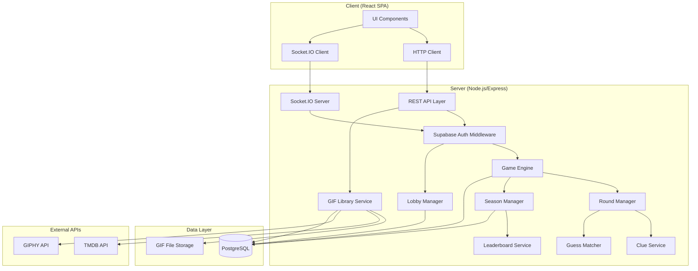
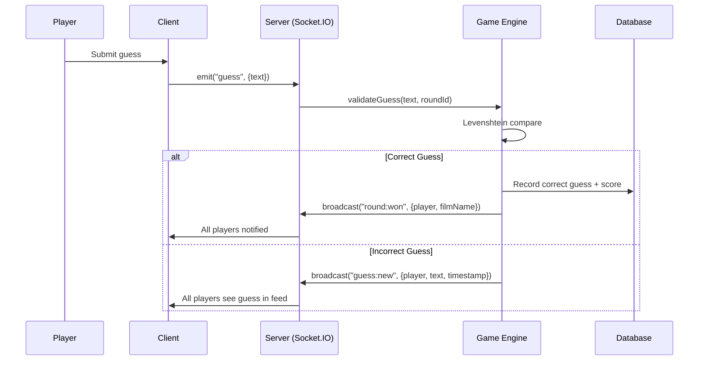
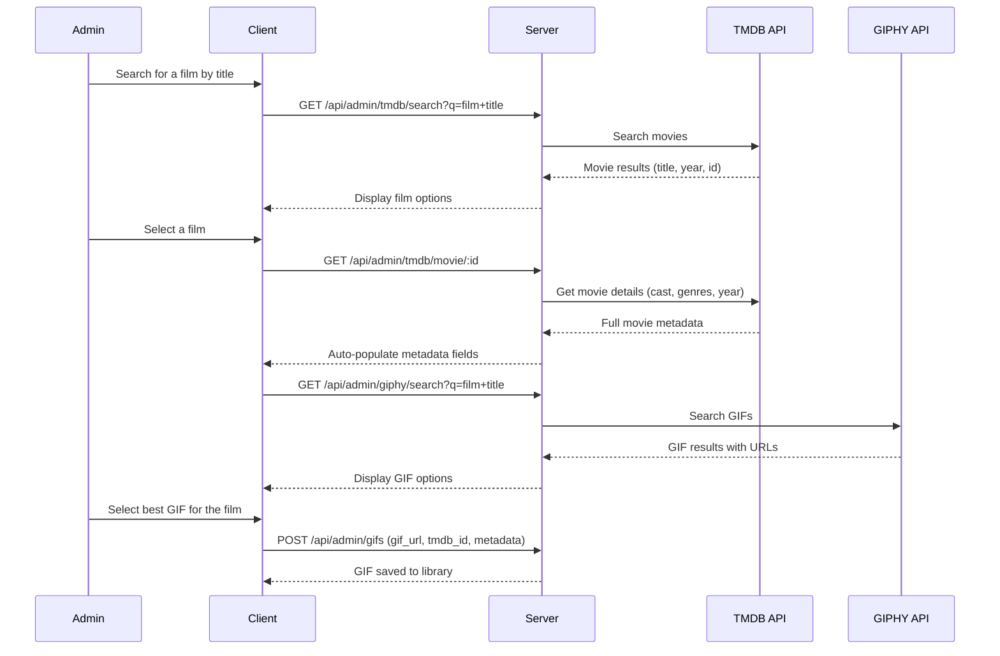
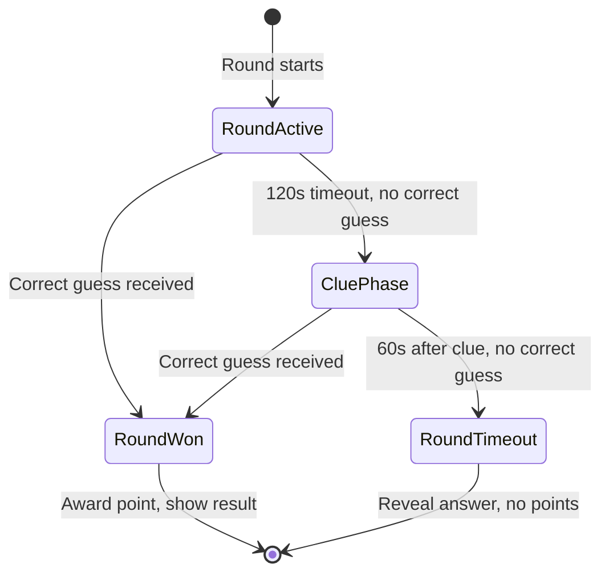
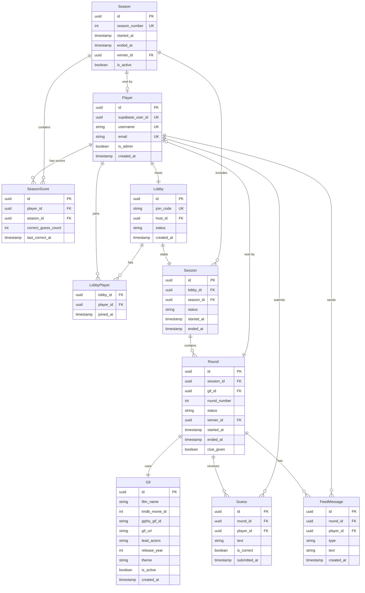

# Design Document: Guess the Gif

## Overview

Guess the Gif is a real-time multiplayer web game where players compete to identify films from animated GIF clips. The system is built as a client-server application with a React frontend and a Node.js/Express backend. Real-time communication is handled via WebSockets (Socket.IO), and data is persisted in PostgreSQL. The game revolves around sessions of 3 rounds each, where players submit guesses in a shared feed. A season-long leaderboard tracks cumulative scores, with the first player to 20 correct guesses winning the season.

### Key Design Decisions

- **WebSocket via Socket.IO**: Chosen for real-time bidirectional communication (guess feed, round events, leaderboard updates). Socket.IO provides automatic reconnection, room-based broadcasting, and fallback to long-polling.
- **PostgreSQL**: Relational database fits the structured data model (players, sessions, rounds, guesses, seasons) with strong referential integrity.
- **Fuzzy matching with Levenshtein distance**: Guesses are compared using case-insensitive matching with a tolerance of up to 2 character differences (Levenshtein distance ≤ 2).
- **Server-authoritative game logic**: All game state transitions (round start, guess validation, clue timing, scoring) are managed server-side to prevent cheating.
- **Supabase Auth**: Third-party authentication via Supabase, handling registration, login, session management, and JWT issuance. The server validates Supabase JWTs on both HTTP requests and WebSocket handshakes. This eliminates custom password hashing, token generation, and session storage.
- **GIPHY API + TMDB API for GIF sourcing**: GIFs are sourced via the GIPHY API (free tier) and film metadata (title, actors, year, genres) is pulled from TMDB API (free for non-commercial use). An admin curation workflow combines both: search TMDB for a film, auto-populate metadata, search GIPHY for matching GIFs, then save the curated pairing to the GIF library.

## Architecture

The system follows a layered architecture with clear separation between transport, game logic, and data access.



### Communication Flow



## Components and Interfaces

### REST API Endpoints

| Method | Path | Description |
|--------|------|-------------|
| POST | `/api/auth/callback` | Handle Supabase auth callback, create/sync player profile |
| GET | `/api/auth/me` | Get current player profile (requires Supabase session) |
| GET | `/api/lobbies` | List available lobbies |
| POST | `/api/lobbies` | Create a new lobby |
| POST | `/api/lobbies/:code/join` | Join lobby by code |
| GET | `/api/leaderboard` | Current season leaderboard |
| GET | `/api/leaderboard/seasons` | Archived season list |
| GET | `/api/leaderboard/seasons/:id` | Archived season leaderboard |
| GET | `/api/admin/gifs` | List GIF library |
| POST | `/api/admin/gifs` | Save curated GIF with TMDB metadata to library |
| PUT | `/api/admin/gifs/:id` | Update GIF metadata |
| DELETE | `/api/admin/gifs/:id` | Remove GIF |
| GET | `/api/admin/tmdb/search` | Search TMDB for films by title (returns film name, actors, year, genres) |
| GET | `/api/admin/tmdb/movie/:id` | Get full TMDB movie details (actors, year, overview/theme) |
| GET | `/api/admin/giphy/search` | Search GIPHY for GIFs by film name query |

### WebSocket Events

**Client → Server:**
| Event | Payload | Description |
|-------|---------|-------------|
| `guess:submit` | `{ text: string }` | Submit a guess |
| `chat:message` | `{ text: string }` | Send a non-guess chat message |
| `session:start` | `{}` | Host starts the session |

**Server → Client:**
| Event | Payload | Description |
|-------|---------|-------------|
| `round:start` | `{ roundNumber, gifUrl }` | New round begins |
| `round:won` | `{ winnerUsername, filmName }` | Round won |
| `round:timeout` | `{ filmName }` | Round ended with no winner |
| `round:clue` | `{ clueType, clueText }` | Clue provided |
| `guess:new` | `{ username, text, timestamp, isCorrect }` | New guess in feed |
| `chat:new` | `{ username, text, timestamp }` | Chat message in feed |
| `session:end` | `{ scores[], sessionSummary }` | Session complete |
| `season:won` | `{ winnerUsername }` | Season winner declared |
| `lobby:update` | `{ players[] }` | Lobby membership changed |
| `player:disconnected` | `{ username }` | Player disconnected |
| `leaderboard:update` | `{ entries[] }` | Leaderboard changed |

### Core Service Interfaces

```typescript
interface GuessMatcher {
  // Returns true if guess is within Levenshtein distance ≤ 2 of filmName (case-insensitive)
  isCorrectGuess(guess: string, filmName: string): boolean;
}

interface RoundManager {
  startRound(sessionId: string, gifId: string): Round;
  submitGuess(roundId: string, playerId: string, text: string): GuessResult;
  provideClue(roundId: string): Clue;
  endRound(roundId: string): RoundResult;
}

interface ClueService {
  // Selects a clue from available metadata, respecting single-word title constraint
  generateClue(gifMetadata: GifMetadata): Clue;
  getAvailableClueTypes(gifMetadata: GifMetadata): ClueType[];
}

interface SeasonManager {
  getCurrentSeason(): Season;
  addPoints(playerId: string, points: number): SeasonScore;
  checkForWinner(): Player | null;
  endSeason(): ArchivedSeason;
}

interface LeaderboardService {
  getRankings(seasonId: string): LeaderboardEntry[];
  getPlayerRank(seasonId: string, playerId: string): LeaderboardEntry;
}

interface TMDBService {
  // Search TMDB for films matching a query string
  searchMovies(query: string): TMDBMovie[];
  // Get full movie details including cast, year, and genres
  getMovieDetails(tmdbMovieId: number): TMDBMovieDetails;
}

interface GiphyService {
  // Search GIPHY for GIFs matching a query (typically a film name)
  searchGifs(query: string, limit?: number): GiphyGif[];
}

interface GIFCurationService {
  // Admin workflow: search TMDB for a film, get metadata, search GIPHY for GIFs, save curated pairing
  searchFilms(query: string): TMDBMovie[];
  getFilmMetadata(tmdbMovieId: number): GifMetadata;
  searchGifsForFilm(filmName: string): GiphyGif[];
  saveToLibrary(gifUrl: string, giphyGifId: string, metadata: GifMetadata): Gif;
}
```


### Guess Matching Algorithm

The guess matcher uses Levenshtein distance for fuzzy matching:

1. Normalize both guess and film name: lowercase, trim whitespace
2. Compute Levenshtein distance between normalized strings
3. If distance ≤ 2, the guess is correct
4. Exact match (distance 0) is also correct

This allows for minor typos ("the godfahter" → "the godfather") while rejecting clearly wrong guesses.

### Admin GIF Curation Workflow

The admin interface provides a semi-automated workflow for building the GIF library using TMDB and GIPHY APIs:



1. Admin searches for a film by title → hits TMDB search API
2. Admin selects the correct film → TMDB movie details auto-populate: film name, lead actors, release year, genres/theme
3. GIPHY is searched using the film name → admin browses and picks the best GIF clip
4. Admin saves the curated GIF + metadata pairing to the library
5. Admin can manually override any auto-populated field before saving

### Clue Selection Logic

When 120 seconds pass without a correct guess, the ClueService selects a clue:

1. Build list of available clue types from GIF metadata:
   - `actors`: Lead actors from the film
   - `year`: Release year
   - `title_word`: One word from the title (only if title has more than one word)
   - `theme`: General theme/genre of the film
2. Randomly select one clue type from the available list
3. For `title_word`, randomly pick one word from the title (excluding articles like "the", "a", "an")
4. Return the clue to all players

### Round Timer Flow



## Data Models

### Entity Relationship Diagram



### Key Data Constraints

- `Session` always contains exactly 3 `Round` records
- `Lobby.status`: `waiting` | `in_session` | `closed`
- `Round.status`: `pending` | `active` | `clue_given` | `won` | `timeout` | `completed`
- `Session.status`: `active` | `completed`
- `Season.is_active`: Only one season can be active at a time
- `SeasonScore` has a unique constraint on `(player_id, season_id)`
- `Gif.is_active`: Soft-delete flag; inactive GIFs are excluded from random selection
- `LeaderboardEntry` ranking tiebreaker: `last_correct_at` ascending (earlier timestamp ranks higher)


## Correctness Properties

*A property is a characteristic or behavior that should hold true across all valid executions of a system — essentially, a formal statement about what the system should do. Properties serve as the bridge between human-readable specifications and machine-verifiable correctness guarantees.*

### Property 1: Player profile creation on auth callback

*For any* valid Supabase user authentication, the auth callback should create a corresponding Player record in the local database with the correct supabase_user_id, email, and username.

**Validates: Requirements 1.1**

### Property 2: Duplicate Supabase user sync is idempotent

*For any* Supabase user who already has a local Player record, calling the auth callback again should not create a duplicate record and should return the existing Player.

**Validates: Requirements 1.3**

### Property 3: Authentication round trip

*For any* valid Supabase sign-up, the resulting session token should allow access to authenticated endpoints. After sign-out via Supabase, the token should no longer grant access.

**Validates: Requirements 1.2, 1.6**

### Property 4: Lobby join codes are unique

*For any* set of created lobbies, all generated join codes should be distinct from one another.

**Validates: Requirements 2.2**

### Property 5: Lobby join round trip

*For any* lobby created by a player, another player using the generated join code should be successfully added to that lobby's player list.

**Validates: Requirements 2.3**

### Property 6: Session start requires minimum players

*For any* lobby, attempting to start a session should succeed if and only if the lobby contains 2 or more players. Lobbies with fewer than 2 players should reject the start request.

**Validates: Requirements 2.4, 2.5**

### Property 7: Cannot join lobby with active session

*For any* lobby that is currently in an active session, a join attempt by a new player should be rejected.

**Validates: Requirements 2.6**

### Property 8: Guess matching with fuzzy tolerance

*For any* film name and any guess string, the guess matcher should return correct if and only if the case-insensitive Levenshtein distance between the guess and the film name is ≤ 2.

**Validates: Requirements 3.5, 3.6**

### Property 9: Active round accepts guesses

*For any* round in "active" or "clue_given" status and any player in the session, submitting a guess should be accepted and recorded.

**Validates: Requirements 3.2**

### Property 10: Won round rejects further guesses

*For any* round that has been won (status "won" or "completed"), submitting a new guess should be rejected.

**Validates: Requirements 3.4**

### Property 11: Clue generation respects metadata constraints

*For any* GIF metadata, the generated clue should be from one of the valid categories (actors, year, title_word, theme), and the title_word category should only be available when the film title contains more than one word.

**Validates: Requirements 3.8, 3.9**

### Property 12: Round result includes film name

*For any* round that ends (whether won or timed out), the round result should contain the correct film name.

**Validates: Requirements 3.11**

### Property 13: Session contains exactly 3 rounds

*For any* created session, it should contain exactly 3 rounds, numbered 1 through 3.

**Validates: Requirements 4.1**

### Property 14: Round winner gets exactly 1 point

*For any* round that ends with a correct guess, exactly 1 point should be awarded, and it should go to the player who submitted the first correct guess.

**Validates: Requirements 4.2**

### Property 15: Session summary contains all player scores

*For any* completed session, the session summary should contain a score entry for every player who participated, and the sum of all points awarded should equal the number of rounds that were won.

**Validates: Requirements 4.4**

### Property 16: Season score accumulation

*For any* sequence of completed sessions within a season, each player's cumulative season score should equal the sum of points they earned across all their sessions.

**Validates: Requirements 4.5, 5.1**

### Property 17: Disconnected player retains points

*For any* player who disconnects during a session, their points earned before disconnection should be preserved in the session and season scores.

**Validates: Requirements 4.6**

### Property 18: Season winner at 20 correct guesses

*For any* player whose cumulative correct guess count reaches 20 within a season, the system should declare them as the season winner.

**Validates: Requirements 5.2**

### Property 19: Season reset on completion

*For any* season that ends, a new season should be created with all player scores reset to zero, and the ended season should be archived with its final results preserved.

**Validates: Requirements 5.4**

### Property 20: Completed season rejects new results

*For any* season that has been completed (has a winner or has been archived), attempting to record new session results should be rejected.

**Validates: Requirements 5.5**

### Property 21: Leaderboard sorting with tiebreaker

*For any* set of season scores, the leaderboard should be sorted by correct guess count in descending order. When two or more players have the same count, the player who reached that count earlier (smaller `last_correct_at` timestamp) should rank higher.

**Validates: Requirements 6.1, 6.4**

### Property 22: Leaderboard entry data completeness

*For any* leaderboard entry, it should contain the player's rank, username, and correct guess count.

**Validates: Requirements 6.3**

### Property 23: GIF upload round trip

*For any* valid GIF upload (with film name, file, and complete clue metadata), the GIF should appear in the GIF library and be retrievable with all its metadata intact.

**Validates: Requirements 7.1**

### Property 24: GIF entry requires complete metadata

*For any* GIF upload attempt missing any required field (film name, GIF file, lead actors, release year, or theme), the upload should be rejected.

**Validates: Requirements 7.2**

### Property 25: Removed GIF excluded from selection

*For any* GIF that has been removed from the library, it should not appear in the pool of GIFs available for new session round selection.

**Validates: Requirements 7.3**

### Property 26: Session GIFs are distinct

*For any* session, the 3 GIFs selected for its rounds should all have distinct identifiers.

**Validates: Requirements 7.4**

### Property 27: GIF film name update round trip

*For any* GIF whose film name is updated by an admin, retrieving that GIF from the library should return the updated film name.

**Validates: Requirements 7.6**

### Property 28: Guess feed entry data completeness

*For any* guess displayed in the feed, it should contain the submitting player's username and a timestamp.

**Validates: Requirements 8.2**

### Property 29: Guess feed chronological order

*For any* list of entries in the guess feed for a round, they should be ordered by timestamp in ascending (chronological) order.

**Validates: Requirements 8.4**

### Property 30: Correct guess is marked in feed

*For any* correct guess in the feed, it should be visually distinguished with an `isCorrect` flag set to true, and all other guesses should have `isCorrect` set to false.

**Validates: Requirements 8.5**

### Property 31: Chat messages accepted during active round

*For any* active round and any player in the session, submitting a non-guess chat message should be accepted and appear in the feed.

**Validates: Requirements 8.6**

### Property 32: Feed retained after round ends

*For any* completed round, the guess feed data should still be retrievable and contain all guesses and chat messages that were submitted during that round.

**Validates: Requirements 8.7**


## Error Handling

### Client-Side Errors

| Error Scenario | Handling Strategy |
|---|---|
| WebSocket disconnection | Auto-reconnect with exponential backoff for up to 30 seconds. Show "Reconnecting..." overlay. If reconnection fails, show disconnection message and redirect to lobby list. |
| Invalid form input (registration/login) | Inline validation with clear error messages. Disable submit button until form is valid. |
| Network timeout on HTTP requests | Retry up to 2 times with 2-second delay. Show toast notification on persistent failure. |
| Expired Supabase session | Use Supabase client's automatic token refresh. If refresh fails, clear local auth state and redirect to login page. |
| Lobby join with invalid code | Display "Lobby not found" message. Do not reveal whether the code existed previously. |

### Server-Side Errors

| Error Scenario | Handling Strategy |
|---|---|
| Guess submitted for inactive round | Return error event via WebSocket: `{ error: "round_not_active" }`. Client ignores and shows no input. |
| Session start with insufficient players | Return 400 with message "Lobby needs at least 2 players to start." |
| Session start with insufficient GIFs | Return 400 with message "Not enough GIFs in the library to start a session." |
| Duplicate email registration | Handled by Supabase Auth — returns appropriate error. Server relays generic message "Email is already in use." |
| Invalid login credentials | Handled by Supabase Auth — returns appropriate error. Client displays generic message "Invalid credentials." |
| GIF upload with missing metadata | Return 400 with list of missing required fields. |
| Join lobby with active session | Return 409 with message "Session is already in progress." |
| Concurrent correct guesses (race condition) | Server-side mutex per round. Only the first correct guess (by server timestamp) wins. Subsequent correct guesses within the processing window are treated as regular guesses. |
| Player disconnects mid-round | Retain player's earned points. Broadcast `player:disconnected` event to remaining players. If all players disconnect, end the session gracefully. |
| Season score update after season ends | Reject the update and log a warning. Return error to the calling service. |
| Database connection failure | Return 503 to client. Game engine pauses round timers until DB is available. Retry with exponential backoff. |
| TMDB API failure | Return 502 with message "Unable to search films. Please try again." Cache recent TMDB results for 1 hour to reduce dependency. |
| GIPHY API failure | Return 502 with message "Unable to search GIFs. Please try again." Admin can still manually enter a GIF URL. |

### WebSocket Error Events

```typescript
// Server → Client error events
interface WSError {
  event: "error";
  payload: {
    code: string;       // Machine-readable error code
    message: string;    // Human-readable message
    recoverable: boolean; // Whether client should retry
  };
}
```

Error codes: `round_not_active`, `session_full`, `lobby_in_session`, `not_authenticated`, `not_authorized`, `server_error`.

### Rate Limiting

- Guess submissions: Max 10 per player per 10-second window per round (prevents spam)
- Chat messages: Max 5 per player per 10-second window
- Lobby creation: Max 3 per player per minute
- Registration: Max 5 attempts per IP per hour
- Login: Max 10 attempts per IP per 15 minutes (with progressive delay)

## Testing Strategy

### Dual Testing Approach

This project uses both unit tests and property-based tests for comprehensive coverage:

- **Unit tests** verify specific examples, edge cases, integration points, and error conditions
- **Property-based tests** verify universal properties across randomly generated inputs
- Together they provide confidence that the system behaves correctly for both known scenarios and unexpected inputs

### Property-Based Testing Configuration

- **Library**: [fast-check](https://github.com/dubzzz/fast-check) for TypeScript/JavaScript
- **Minimum iterations**: 100 per property test
- **Each property test must reference its design document property** using the tag format:
  `Feature: guess-the-gif, Property {number}: {property_text}`
- **Each correctness property is implemented by a single property-based test**

### Test Categories

#### Property-Based Tests (via fast-check)

These tests validate the correctness properties defined above. Each property maps to one test.

| Property | Test Description | Generator Strategy |
|---|---|---|
| P1: Player profile creation | Generate Supabase user data, call auth callback, verify Player record created with matching fields | `fc.record({ supabaseUserId: fc.uuid(), email: fc.emailAddress(), username: fc.string() })` |
| P2: Duplicate user sync idempotent | Generate existing player, call auth callback again, verify no duplicate and same record returned | `fc.record({ supabaseUserId: fc.uuid(), email: fc.emailAddress() })` |
| P3: Auth round trip | Generate valid Supabase session token, verify access granted; after sign-out, verify access denied | `fc.record({ supabaseUserId: fc.uuid() })` |
| P4: Lobby join code uniqueness | Create N lobbies, verify all codes distinct | `fc.integer({ min: 2, max: 50 })` for lobby count |
| P5: Lobby join round trip | Create lobby, join with code, verify player in list | `fc.record({ hostId, joinerId })` |
| P6: Session start minimum players | Generate lobby with 0..N players, verify start succeeds iff ≥ 2 | `fc.array(fc.uuid())` for player lists |
| P7: Cannot join active session lobby | Generate lobby in active state, attempt join, verify rejection | `fc.record({ lobbyState, playerId })` |
| P8: Guess matching fuzzy tolerance | Generate film name + guess pairs, verify matcher agrees with Levenshtein ≤ 2 | `fc.tuple(fc.string(), fc.string())` |
| P9: Active round accepts guesses | Generate active round + player + guess text, verify acceptance | `fc.record({ roundStatus: fc.constant("active"), guess: fc.string() })` |
| P10: Won round rejects guesses | Generate won/completed round + guess, verify rejection | `fc.record({ roundStatus: fc.constantFrom("won","completed"), guess: fc.string() })` |
| P11: Clue generation constraints | Generate GIF metadata, verify clue type is valid and title_word excluded for single-word titles | `fc.record({ filmName, actors, year, theme })` |
| P12: Round result includes film name | Generate round result, verify film name present | `fc.record({ filmName, roundStatus: fc.constantFrom("won","timeout") })` |
| P13: Session has 3 rounds | Create session, verify exactly 3 rounds numbered 1-3 | `fc.record({ lobbyId, gifIds: fc.uniqueArray(fc.uuid(), { minLength: 3, maxLength: 3 }) })` |
| P14: Round winner gets 1 point | Generate round with correct guess, verify exactly 1 point awarded to first guesser | `fc.array(fc.record({ playerId, guess, timestamp }))` |
| P15: Session summary completeness | Generate completed session with players, verify all players have score entries | `fc.array(fc.uuid(), { minLength: 2 })` for player IDs |
| P16: Season score accumulation | Generate sequence of session results, verify cumulative scores equal sums | `fc.array(fc.record({ playerId, points }))` |
| P17: Disconnected player retains points | Generate player with points then disconnect, verify points preserved | `fc.record({ playerId, pointsBefore: fc.nat() })` |
| P18: Season winner at 20 | Generate player with score reaching 20, verify winner declaration | `fc.integer({ min: 0, max: 25 })` for score progression |
| P19: Season reset | End season, verify new season has zero scores and old is archived | `fc.array(fc.record({ playerId, score }))` for final scores |
| P20: Completed season rejects results | Generate completed season, attempt to add results, verify rejection | `fc.record({ seasonId, sessionResult })` |
| P21: Leaderboard sorting with tiebreaker | Generate scores with ties, verify descending order with timestamp tiebreaker | `fc.array(fc.record({ playerId, count: fc.nat(), lastCorrectAt: fc.date() }))` |
| P22: Leaderboard entry completeness | Generate leaderboard entries, verify each has rank, username, count | `fc.array(fc.record({ playerId, username, count }))` |
| P23: GIF upload round trip | Upload GIF with metadata, retrieve, verify all fields match | `fc.record({ filmName, actors, year, theme })` |
| P24: GIF requires complete metadata | Generate GIF uploads with missing fields, verify rejection | `fc.record()` with optional fields set to undefined |
| P25: Removed GIF excluded | Remove GIF, verify it's not in selection pool | `fc.record({ gifId, isActive: fc.constant(false) })` |
| P26: Session GIFs are distinct | Generate session GIF selection, verify 3 distinct IDs | `fc.uniqueArray(fc.uuid(), { minLength: 5 })` for GIF pool |
| P27: GIF film name update round trip | Update film name, retrieve, verify new name returned | `fc.tuple(fc.string(), fc.string())` for old/new names |
| P28: Feed entry completeness | Generate feed entries, verify each has username and timestamp | `fc.record({ username: fc.string(), text: fc.string() })` |
| P29: Feed chronological order | Generate feed with multiple entries, verify ascending timestamp order | `fc.array(fc.record({ text, timestamp: fc.date() }))` |
| P30: Correct guess marked in feed | Generate feed with one correct guess, verify only it has isCorrect=true | `fc.array(fc.record({ text, isCorrect: fc.boolean() }))` |
| P31: Chat messages during active round | Generate active round + chat message, verify acceptance | `fc.record({ roundStatus: fc.constant("active"), message: fc.string() })` |
| P32: Feed retained after round | Generate completed round, query feed, verify all entries present | `fc.array(fc.record({ text, timestamp }))` for feed entries |

#### Unit Tests

Unit tests cover specific examples, edge cases, and integration points:

**Authentication (Supabase Auth integration):**
- Supabase sign-up triggers player profile creation in local DB
- Duplicate email sign-up is rejected by Supabase
- Supabase login returns valid session with access token
- Auth callback syncs Supabase user to local Player record
- Player profile includes username, supabase_user_id, and admin flag
- Logout via Supabase client clears session

**Lobby & Session:**
- Create lobby returns 6-character alphanumeric code
- Join lobby with valid code adds player
- Join lobby with invalid code returns 404
- Start session with 1 player returns error
- Start session with 2 players creates 3 rounds

**Gameplay:**
- Exact match "The Godfather" is correct
- Case-insensitive "the godfather" is correct
- Fuzzy match "The Godfater" (1 edit) is correct
- Fuzzy match "The Godfatr" (2 edits) is correct
- "The Godftr" (3+ edits) is incorrect
- Clue for single-word title "Jaws" excludes title_word type
- Clue for multi-word title "Star Wars" may include title_word type
- Round times out after 120s with no correct guess → clue provided
- Round times out after 60s post-clue → round ends, no points

**Scoring & Seasons:**
- First correct guess in round awards 1 point
- No correct guess in round awards 0 points
- Player reaching 20 correct guesses triggers season win
- Season archive preserves final leaderboard
- New season starts with all scores at 0

**GIF Management:**
- TMDB search returns matching films with metadata
- TMDB movie details include actors, year, and genres
- GIPHY search returns GIF URLs for a film query
- Save curated GIF with TMDB metadata to library succeeds
- Save GIF missing release_year is rejected
- Remove GIF sets is_active to false
- Session creation with < 3 active GIFs fails
- 3 GIFs selected for session are all different
- TMDB API failure returns 502 with descriptive message
- GIPHY API failure returns 502 with descriptive message

**Guess Feed:**
- Guess appears in feed with username and timestamp
- Correct guess has isCorrect flag set
- Feed entries are in chronological order
- Chat messages appear alongside guesses
- Feed is preserved after round ends

**Real-Time (Integration):**
- WebSocket connects with valid Supabase access token
- WebSocket rejects connection with invalid or expired Supabase token
- Guess event is broadcast to all players in session room
- Reconnection within 30s restores session state
- Disconnection after 30s removes player from session
